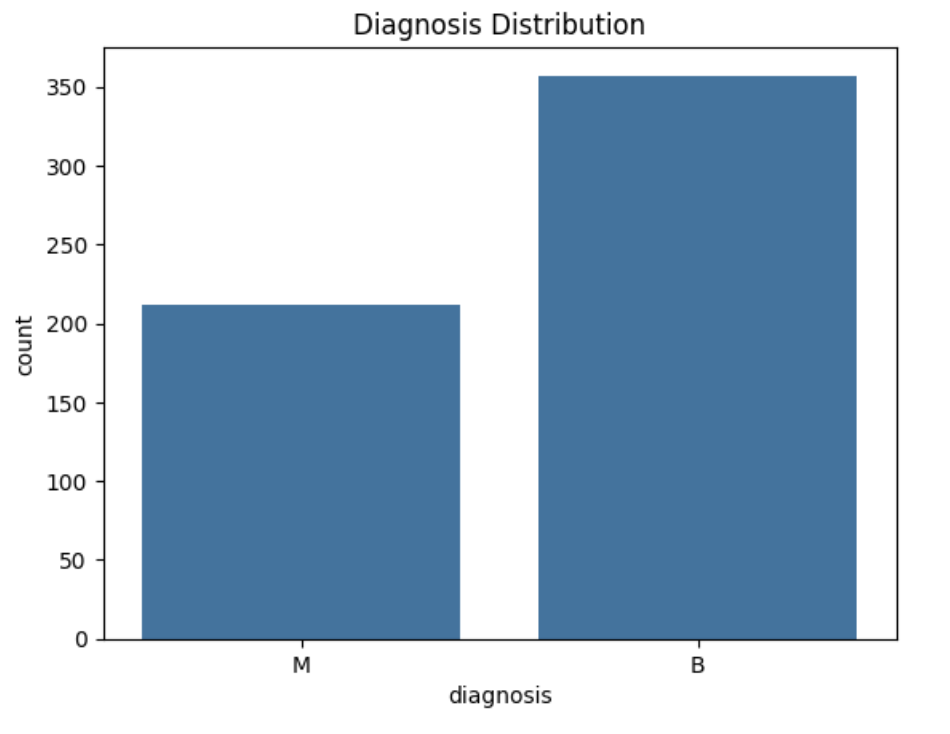
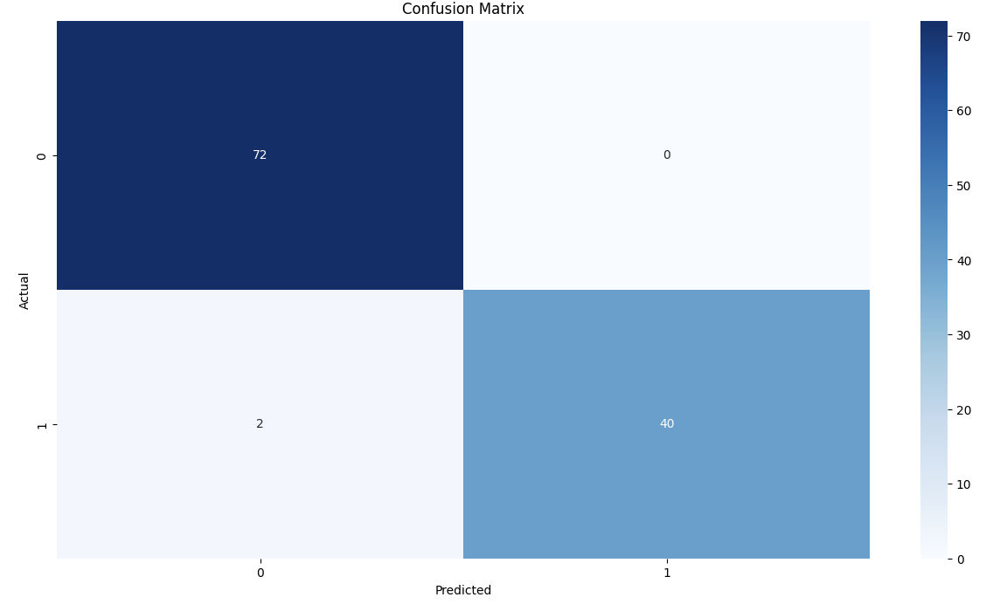

<div align="center">

#  Breast Cancer Classification using Support Vector Machines

### Support Vector Machines • Machine Learning • Scikit-Learn • Medical AI


</div>

---

#  Project Overview

Breast cancer is one of the most common cancers worldwide, making early diagnosis extremely important.

This project develops and evaluates multiple **Support Vector Machine (SVM)** models for classifying breast tumors as **Benign** or **Malignant** using the Wisconsin Breast Cancer Diagnostic Dataset.

The notebook explores different SVM kernels, compares their performance with Logistic Regression, performs hyperparameter tuning using GridSearchCV, and evaluates the final model using multiple performance metrics.

---

#  Dataset

**Dataset:** Breast Cancer Wisconsin Diagnostic Dataset

- 569 samples
- 30 numerical features
- Binary Classification

Target Classes

| Label | Meaning |
|------|---------|
| 0 | Benign |
| 1 | Malignant |

---

#  Project Workflow

```
Dataset

↓

Exploratory Data Analysis

↓

Data Preprocessing

↓

Feature Scaling

↓

Logistic Regression Baseline

↓

Linear SVM

↓

Polynomial SVM

↓

RBF SVM

↓

Hyperparameter Tuning

↓

Model Evaluation

↓

Performance Comparison
```

---

#  Models Compared

- Logistic Regression
- Linear Support Vector Machine
- Polynomial Support Vector Machine
- Radial Basis Function (RBF) Support Vector Machine
- Tuned RBF Support Vector Machine

---

#  Results

## Cross Validation Performance

| Model | Mean CV Accuracy |
|------|-----------------:|
| 🥇 RBF SVM | **97.36%** |
| 🥇 Tuned RBF SVM | **97.36%** |
| 🥈 Linear SVM | **96.48%** |
| 🥉 Logistic Regression | **95.16%** |
| Polynomial SVM | **90.11%** |

---

##  Best Model

**Tuned RBF Support Vector Machine**

| Metric | Score |
|------|-------:|
| Test Accuracy | **98.25%** |
| Mean CV Accuracy | **97.36%** |
| Precision | **100.00%** |
| Recall | **95.24%** |
| F1 Score | **97.56%** |

---

#  Visualizations

## Diagnosis Distribution



---

## Model Comparison


---

## Confusion Matrix




---

# 💡 Key Insights

- Logistic Regression provided a strong baseline classifier.
- Linear SVM improved performance by maximizing the decision margin.
- Polynomial SVM introduced additional complexity but achieved lower accuracy.
- RBF Kernel produced the best balance between flexibility and generalization.
- Hyperparameter tuning confirmed that the default RBF kernel was already close to optimal for this dataset.

---

# 📦 Repository Structure

```
breast-cancer-classification-svm/

│

├── notebook/

│   └── breast-cancer-classification.ipynb

│

├── images/

│   ├── diagnosis_distribution.png

│   ├── confusion_matrix.png

│   ├── model_comparison.png


│

├── requirements.txt

├── README.md

├── LICENSE

```

---

#  Installation

Clone the repository

```bash
git clone https://github.com/YOUR_USERNAME/breast-cancer-classification-svm.git
```

Install dependencies

```bash
pip install -r requirements.txt
```

Launch Jupyter Notebook

```bash
jupyter notebook
```

---

#  Future Improvements

- Feature Selection
- PCA Visualization
- XGBoost Comparison
- Random Forest Comparison
- Deep Learning Approach
- Model Deployment using Streamlit

---

#  Technologies Used

- Python
- Pandas
- NumPy
- Scikit-Learn
- Matplotlib
- Seaborn
- Jupyter Notebook

---

#  Author

**RL Yuwin**

Machine Learning • AI • Kaggle • Open Source

If you found this project helpful, consider giving it a ⭐.
